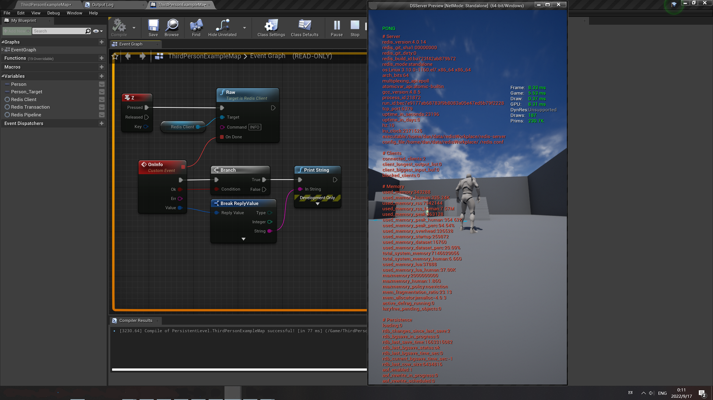
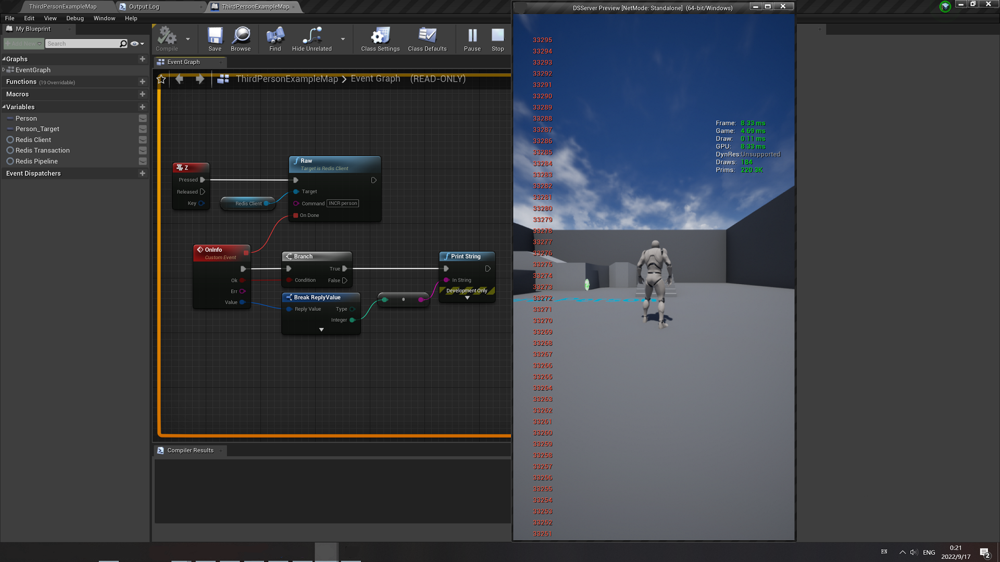
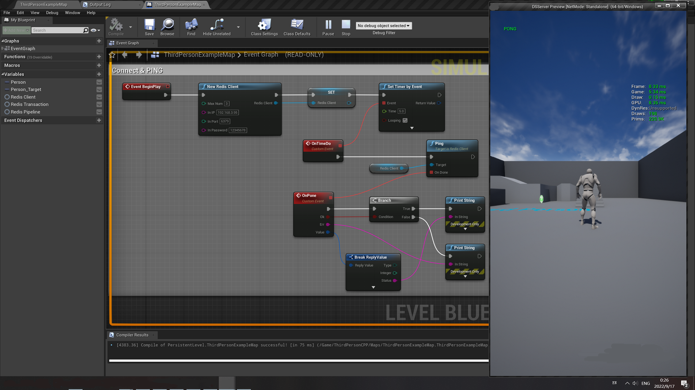
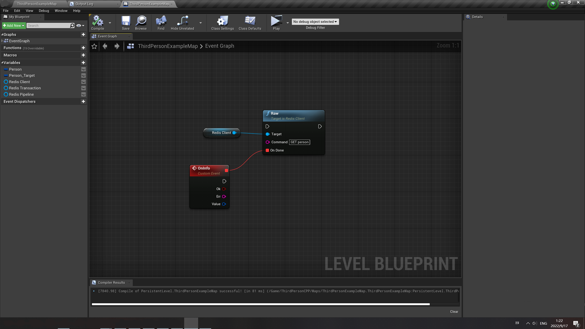
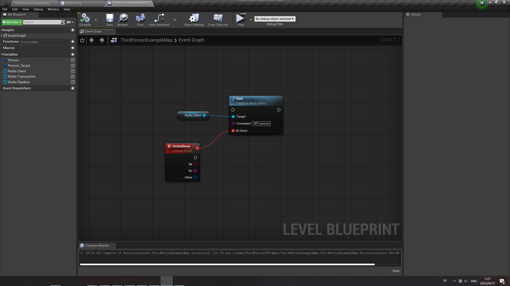

# NanoRedisClient
  
If you want to support me, please give me a star  
With this plugin you can connect to an external redis server to have powerful data storage or caching capabilities  

## example

## Features

1. With this plugin you can connect to an external redis server to have powerful data storage or caching capabilities
2. This plugin provides very few and minimal api functions
3. Built on the official open source project [hiredis](https://github.com/redis/hiredis)
4. Non-blocking fully asynchronous

Currently supported:	transaction, pipeline

Currently hiredis version:	1.0.2

Currently supported redis versions:	2.x, 3.x, 4.x, 5.x

## Doc
https://docs.google.com/document/d/1gWHDhdtH0yOKMvrL83KNTaNwU1suUcZYdzREggl8864/edit?usp=sharing

## Demo
https://github.com/DAN-AND-DNA/UE_NanoRedisClient
